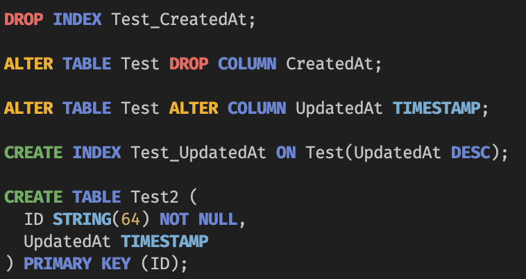

# spannerdiff

Schema migration tool for Cloud Spanner.

Note: This tool is currently under development. The interface may change.

## Installation

```sh
$ brew install morikuni/tap/spannerdiff 
```

## Supported DDL

- `CREATE SCHEMA`
- `CREATE TABLE`
- `CREATE INDEX`
- `CREATE SEARCH INDEX`
- `CREATE PROPERTY GRAPH`
- `CREATE VIEW`
- `CREATE CHANGE STREAM`
- `CREATE SEQUENCE`
- `CREATE VECTOR INDEX`
- `CREATE MODEL`
- `CREATE PROTO BUNDLE`
- `CREATE ROLE`
- `GRANT`
- `ALTER DATABASE`

## Colored Output



## Example

```sh
$ gcloud spanner databases ddl describe test
```

```sql
CREATE TABLE Test (
    ID STRING(64) NOT NULL,
    Name STRING(64) NOT NULL,
) PRIMARY KEY (ID);

CREATE INDEX Test_Name ON Test (Name);
```

```sh
$ cat schema.sql
```

```sql
CREATE TABLE Test (
    ID STRING(64) NOT NULL,
    Name STRING(64) NOT NULL,
    CreatedAt TIMESTAMP NOT NULL DEFAULT (CURRENT_TIMESTAMP()),
) PRIMARY KEY (ID);

CREATE INDEX Test_Name_CreatedAt ON Test (Name, CreatedAt DESC);
```

```sh
$ gcloud spanner databases ddl describe test | spannerdiff --base-stdin --target-file=schema.sql | tee tmp.sql
```

```sql
DROP INDEX Test_Name;

ALTER TABLE Test ADD COLUMN CreatedAt TIMESTAMP NOT NULL DEFAULT (CURRENT_TIMESTAMP());

CREATE INDEX Test_Name_CreatedAt ON Test(Name, CreatedAt DESC);
```

```sh
$ gcloud spanner databases ddl update test --ddl-file=tmp.sql
Schema updating...done.
```

## Unsupported DDL

DDL statements that are not listed in [Supported DDL](#supported-ddl) are ignored with a warning.
Use `--error-on-unsupported-ddl` to exit with an error instead.

## Known Issues & Limitations

- View DDL generation may be incorrect or out of order due to unresolved column names in the view query.
- Changes that can't be done by `ALTER` statements are migrated by dropping and recreating the object (e.g. changing the type of a column, or the primary key of a table). This deletes the data in it, so review the generated DDL before applying it.
- An unnamed constraint in the base schema can't be dropped. Spanner names unnamed constraints, so use the schema returned by Spanner (e.g. `gcloud spanner databases ddl describe`) as the base schema.
